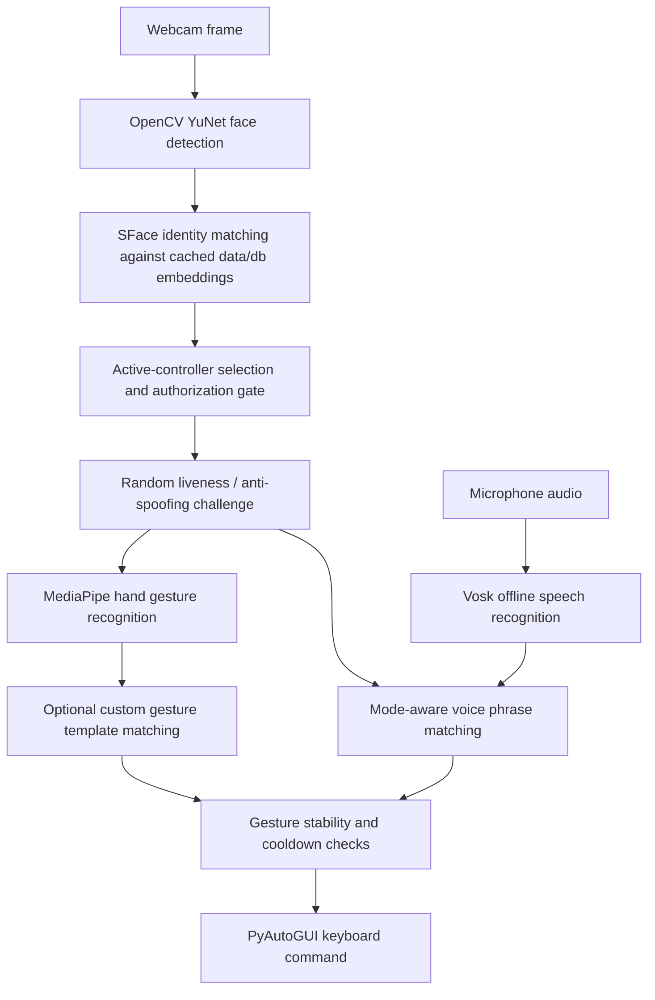

# Vision Gesture Media Control

Vision-based human-computer interaction system for controlling presentations, local media players, and YouTube with hand gestures and voice commands. The app opens the webcam, detects faces, recognizes whether the visible user is authorized, then enables commands only for the active authorized controller.

The project was designed for a computer vision course task that extends face recognition and emotion analysis into a gesture-controlled media/presentation system.

## Features

- Webcam-based face detection with OpenCV YuNet.
- Authorized-user recognition with cached OpenCV SFace embeddings.
- Background DeepFace emotion analysis.
- Built-in hand gestures with MediaPipe Gesture Recognizer.
- Custom gesture capture using 5 normalized hand-landmark templates.
- Optional offline voice commands with Vosk.
- Random liveness/anti-spoofing challenge before gesture control unlocks.
- Presentation, local video, and YouTube control modes.
- Swipe gestures for seek forward/backward.
- Dry-run mode for testing gestures without pressing keys.
- On-screen gesture legend and performance telemetry.
- Face database reload and delete controls.
- Public-safe repo layout: model files, face images, and custom biometric templates are ignored by git.

## Requirements

- Python 3.11 recommended.
- Windows is the primary tested environment.
- A working webcam.
- A microphone for voice control.
- PowerPoint, a local video player, or a browser tab open when testing external control.
- Internet access on first run so the app can download model files.

Install dependencies:

```powershell
python -m pip install -r requirements.txt
```

If you prefer an isolated environment:

```powershell
python -m venv .venv
.\.venv\Scripts\activate
python -m pip install --upgrade pip
python -m pip install -r requirements.txt
```

## Quick Start

1. Clone the repository:

   ```powershell
   git clone https://github.com/AbdelrahmanAboegela/vision-gesture-media-control.git
   cd vision-gesture-media-control
   ```

2. Install dependencies:

   ```powershell
   python -m pip install -r requirements.txt
   ```

3. Run the app:

   ```powershell
   python main.py
   ```

4. Press `a` and register your face. The app captures 5 samples into `data/db/<your_name>/`.

5. Open PowerPoint, a local video player, or YouTube.

6. Press `m` to select the target mode.

7. Complete the random liveness challenge shown in the overlay.

8. Use the gestures listed below, or press `v` to enable voice commands.

## Project Layout

```text
.
|-- main.py                         # Thin launcher
|-- requirements.txt                # Python dependencies
|-- README.md
|-- src/
|   `-- vision_gesture_control/
|       |-- __init__.py
|       `-- app.py                  # Application code
|-- config/
|   |-- gesture_config.json         # Runtime settings and gesture/action bindings
|   |-- custom_gestures.example.json
|   `-- custom_gestures.json        # Generated locally, ignored by git
|-- data/
|   `-- db/                         # Private face samples, ignored by git
`-- models/                         # Downloaded model files, ignored by git
```

## Model Files

The app downloads these files automatically into `models/` if they are missing:

| File | Source |
|---|---|
| `models/face_detection_yunet.onnx` | [OpenCV YuNet](https://github.com/opencv/opencv_zoo/raw/main/models/face_detection_yunet/face_detection_yunet_2023mar.onnx) |
| `models/face_recognition_sface_2021dec.onnx` | [OpenCV SFace](https://github.com/opencv/opencv_zoo/raw/main/models/face_recognition_sface/face_recognition_sface_2021dec.onnx) |
| `models/gesture_recognizer.task` | [MediaPipe Gesture Recognizer](https://storage.googleapis.com/mediapipe-models/gesture_recognizer/gesture_recognizer/float16/latest/gesture_recognizer.task) |
| `models/vosk-model-small-en-us-0.15/` | [Vosk small English model](https://alphacephei.com/vosk/models/vosk-model-small-en-us-0.15.zip) |

These files are excluded from git because they are downloaded runtime assets and can be large.

## Keyboard Controls

| Key | Action |
|---|---|
| `q` | Quit |
| `a` | Register a new authorized person |
| `c` | Capture a custom gesture template |
| `d` | Delete a registered person |
| `m` | Cycle mode: `presentation -> video -> youtube` |
| `r` | Reload the face database without restart |
| `t` | Toggle dry-run mode |
| `v` | Toggle voice control and show the voice command legend |

## Gesture Controls

After face recognition, complete the random liveness challenge shown in the camera overlay. The challenge is generated from head-turn and hand-gesture instructions, for example `Turn head LEFT`, `Show THUMB UP`, or `Show VICTORY`. Only the active authorized user can pass it.

After liveness passes, use the configured gestures directly. Commands still require a stable gesture, the active user's hand zone, and the normal action cooldown.

| Mode | Gesture | Action |
|---|---|---|
| Global | `ILoveYou` | Cycle mode |
| Presentation | `Thumb_Up` | Next slide |
| Presentation | `Thumb_Down` | Previous slide |
| Presentation | `Victory` | Start slideshow |
| Presentation | `Closed_Fist` | Exit slideshow |
| Video | `Open_Palm` | Play/Pause |
| Video | `Pointing_Up` | Mute/Unmute |
| Video | `Thumb_Up` | Volume up |
| Video | `Thumb_Down` | Volume down |
| Video | `Victory` | Speed up |
| Video | `Closed_Fist` | Speed down |
| Video | `Swipe_Right` | Seek forward |
| Video | `Swipe_Left` | Seek backward |
| YouTube | `Open_Palm` | Play/Pause |
| YouTube | `Pointing_Up` | Mute/Unmute |
| YouTube | `Thumb_Up` | Volume up |
| YouTube | `Thumb_Down` | Volume down |
| YouTube | `Victory` | Speed up |
| YouTube | `Closed_Fist` | Speed down |
| YouTube | `Swipe_Right` | Seek forward |
| YouTube | `Swipe_Left` | Seek backward |

The camera view is mirrored by default. Swipe in the direction shown on the camera window: right for forward, left for backward.

## Voice Controls

Press `v` to toggle voice control. Voice commands are mode-aware and use the current `presentation`, `video`, or `youtube` section in `config/gesture_config.json`. The voice legend appears only while voice is enabled.

Voice control uses the same authorization gate as gestures: the active user must be recognized, pass the liveness challenge, and remain the selected controller. Voice commands then trigger the same action names as gesture bindings.

Default examples:

| Mode | Say | Action |
|---|---|---|
| Global | `cycle mode` | Cycle mode |
| Presentation | `next slide` | Next slide |
| Presentation | `previous slide` | Previous slide |
| Presentation | `start slideshow` | Start slideshow |
| Presentation | `exit slideshow` | Exit slideshow |
| Video/YouTube | `play pause` | Play/Pause |
| Video/YouTube | `mute` or `unmute` | Mute/Unmute |
| Video/YouTube | `volume up` | Volume up |
| Video/YouTube | `volume down` | Volume down |
| Video/YouTube | `speed up` | Speed up |
| Video/YouTube | `speed down` | Speed down |
| Video/YouTube | `seek forward` or `skip forward` | Seek forward |
| Video/YouTube | `seek backward` or `skip backward` | Seek backward |

## External App Control

The app sends keyboard shortcuts through PyAutoGUI. That means the target app must be focused or focusable.

Default profiles:

| Mode | Profile | Example keys |
|---|---|---|
| `presentation` | `powerpoint` | Right, Left, F5, Esc |
| `video` | `generic_video` | Space, media volume keys, Left/Right, `[` and `]` |
| `youtube` | `youtube_video` | Space, `m`, Up/Down, Left/Right, Shift+`,` and Shift+`.` |

Target-window focusing is best-effort and configured in `config/gesture_config.json`:

- `external_controls.focus_before_action`: tries to focus the target app before pressing keys.
- `external_controls.require_target_window`: if true, blocks actions unless a target window is found.
- `external_controls.target_windows`: title keywords used to find PowerPoint, video players, or browsers.

Use `t` to enable dry-run mode when testing gestures. In dry-run mode, the camera overlay shows the action that would run, but no keyboard key is pressed.

## Face Database And Privacy

Registered users are stored locally under:

```text
data/db/<person_name>/sample_0.jpg
data/db/<person_name>/sample_1.jpg
...
```

The `data/db/` contents are ignored by git and should not be pushed to a public repository. Deleting a folder removes that person after pressing `r` or restarting the app.

Custom gesture templates are saved to:

```text
config/custom_gestures.json
```

That file is also ignored by git because it may contain personal biometric hand-landmark samples. The repo includes `config/custom_gestures.example.json` only as an empty template.

## Recognition And Authorization Logic

Only one active controller is allowed at a time:

- A detected face must match a registered authorized user.
- The active controller is the largest/most-central authorized face.
- If an unknown face becomes clearly foreground, controls lock.
- If two authorized users are similarly prominent, controls lock as ambiguous.
- If the active controller disappears, the app allows a short grace period, then locks.
- Hand gestures are accepted only when the hand appears closest to the active controller.

This prevents an unauthorized person in the background from controlling the system and prevents ambiguous multi-user control.

## Liveness And Anti-Spoofing

Liveness is required after the active face is recognized and before gesture commands are accepted. The app generates a random sequence from configured head and hand instructions.

Default challenge pool:

| Challenge | How it is checked |
|---|---|
| `head_left` | YuNet nose landmark moves left inside the face box |
| `head_right` | YuNet nose landmark moves right inside the face box |
| `hand_thumb_up` | MediaPipe detects `Thumb_Up` from the active user's hand |
| `hand_thumb_down` | MediaPipe detects `Thumb_Down` from the active user's hand |
| `hand_victory` | MediaPipe detects `Victory` from the active user's hand |
| `hand_fist` | MediaPipe detects `Closed_Fist` from the active user's hand |
| `hand_point` | MediaPipe detects `Pointing_Up` from the active user's hand |

By default, each liveness session uses 2 random steps and tries to mix one head-related and one hand-related instruction. If the user times out, a new random challenge is generated. Liveness resets when the active controller changes, disappears, or the identity database is reloaded.

## Configuration Guide

Most behavior is configured in `config/gesture_config.json`.

Common settings:

| Setting | Purpose |
|---|---|
| `camera.primary_index` | Main webcam index |
| `camera.fallback_index` | Backup webcam index |
| `camera.mirror` | Mirror the camera feed |
| `face.sface_cosine_threshold` | Face recognition acceptance threshold |
| `gestures.confidence_threshold` | Minimum built-in gesture confidence |
| `gestures.action_cooldown_seconds` | Minimum time between repeated actions |
| `liveness.enabled` | Enable/disable random anti-spoofing challenge |
| `liveness.steps_per_challenge` | Number of random liveness steps |
| `liveness.require_mixed_types` | Prefer both head and hand instructions in one challenge |
| `liveness.head_offset_threshold` | Nose offset needed for head-turn challenges |
| `liveness.step_timeout_seconds` | Time before a new liveness challenge is generated |
| `voice.enabled` | Start voice control enabled/disabled |
| `voice.bindings` | Mode-aware phrase-to-action mapping |
| `voice.command_cooldown_seconds` | Minimum time between repeated voice actions |
| `voice.phrase_match_threshold` | Fuzzy phrase match threshold |
| `voice.model_path` | Local Vosk model directory |
| `bindings` | Gesture-to-action mapping |
| `external_controls.profiles` | Action-to-key mapping |
| `ui.show_legend` | Show/hide gesture legend |
| `ui.show_performance` | Show/hide FPS/performance stats |
| `ui.legend_position` | Legend placement: `auto`, `top_left`, `top_right`, `bottom_left`, `bottom_right` |
| `ui.performance_position` | Performance panel placement: `bottom_left` or `bottom_right` |

## Add Or Change A Gesture Binding

Built-in MediaPipe gestures available for binding:

```text
Closed_Fist
Open_Palm
Pointing_Up
Thumb_Down
Thumb_Up
Victory
ILoveYou
```

To change a gesture, edit `config/gesture_config.json`.

Example: make `Victory` mute/unmute in YouTube mode:

```json
"youtube": {
  "Victory": "mute_toggle"
}
```

The action must exist in the active external control profile.

## Add A New Action

1. Add the action key sequence to the correct profile in `external_controls.profiles`.
2. Bind a gesture to that action in `bindings`.
3. Restart the app or reload config by restarting the Python process.

Example:

```json
"youtube_video": {
  "fullscreen": ["f"]
},
"youtube": {
  "Closed_Fist": "fullscreen"
}
```

## Custom Gesture Capture

Press `c` while the app is running:

1. Enter a gesture name.
2. Enter an action name, for example `play_pause` or `mute_toggle`.
3. Show the gesture to the camera.
4. The app captures 5 normalized hand-landmark samples.
5. The template is saved locally in `config/custom_gestures.json`.

Custom gestures are matched with landmark-template distance and override built-in gestures only when the match is below `gestures.custom_match_threshold`.

## Architecture



Emotion analysis runs in a background thread using DeepFace so it does not block the camera loop.

## Optimization Notes

The original version ran `DeepFace.find(...)` and `DeepFace.analyze(...)` inside the display loop for every detected face. That made the camera feed depend on heavy model calls.

The current version is smoother because:

- Identity samples are embedded once into an SFace cache.
- Live identity checks happen only when face tracks become stable or need re-identification.
- Emotion analysis is asynchronous.
- Gesture detection uses MediaPipe live-stream mode.
- Voice recognition runs in a background thread.
- The UI loop draws the latest available results instead of waiting for every model.

## Troubleshooting

### Camera does not open

- Check that no other app is using the webcam.
- Change `camera.primary_index` or `camera.fallback_index` in `config/gesture_config.json`.

### Gestures are detected but nothing happens

- Make sure the app is unlocked by an authorized face.
- Complete the liveness challenge shown in the overlay.
- Make sure the target app is open and focused.
- Press `t` to use dry-run mode and confirm the app is detecting the intended action.
- If focus is unreliable, set `external_controls.require_target_window` to `false`.

### Voice commands are not working

- Press `v` and confirm the overlay says `Voice listening`.
- Make sure `vosk` and `sounddevice` installed successfully from `requirements.txt`.
- Confirm `models/vosk-model-small-en-us-0.15/` exists, or let the app download it on first voice start.
- Complete face recognition and liveness first; voice actions are ignored while locked.
- Use phrases from the voice legend for the current mode.

### YouTube controls affect the wrong window

- Click the YouTube browser tab before testing.
- Add your browser/window title to `external_controls.target_windows.youtube_video`.

### Face recognition fails

- Register again with `a` using clear lighting.
- Capture samples from slightly different head angles.
- Press `r` to reload the database.
- Lower or raise `face.sface_cosine_threshold` carefully if needed.

### Liveness challenge is hard to pass

- Stand centered and keep your face fully visible.
- Use good lighting so YuNet landmarks are stable.
- For head challenges, turn enough for the nose landmark to shift inside the face box.
- For hand challenges, keep the hand close to the active authorized user.
- Tune `liveness.head_offset_threshold`, `liveness.hand_confidence_threshold`, or `liveness.step_timeout_seconds` in `config/gesture_config.json`.

### First run is slow

The first run may download model files and initialize TensorFlow/MediaPipe. Later runs should start faster.

## Demo Checklist

1. Install dependencies.
2. Run `python main.py`.
3. Register at least one authorized person with `a`.
4. Open PowerPoint, a local video player, or YouTube.
5. Press `m` until the correct mode is shown.
6. Complete the random liveness challenge.
7. Try the mode-specific gestures.
8. Press `v` and try the mode-specific voice phrases.
9. Press `t` for dry-run mode when debugging.
10. Press `r` after manually changing `data/db/`.

## Public Repository Safety

The following are intentionally not committed:

- Face images in `data/db/`.
- Custom hand templates in `config/custom_gestures.json`.
- Downloaded model binaries in `models/`.
- Python cache files.

This keeps the public repository reproducible without exposing private biometric data or pushing large downloaded assets.
